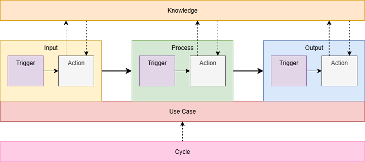

# [WIP] ブレインプロンプトアーキテクチャ
ブレインプロンプトアーキテクチャ(以降ブレインアーキテクチャと呼びます)は、機能性と保守性の高いプロンプトを容易に実装できるようにするために生まれたアーキテクチャです。  
これにより、誰でも容易に機能性と保守性が高いプロンプトを構築することができます。　

# なぜブレインアーキテクチャを使うの？
中規模〜大規模なプロンプトを実装していると、プロンプト同士が干渉し合って動作確認が難しくなったり、レビューしてもプロンプトの抜け漏れが発生したりしていませんか？

その対策としてプロンプトの書き方をルール化しても、人の文章力やタスクの言語化能力を埋めるに至らず、プロンプトが混沌としてしまうことはないでしょうか？

ブレインアーキテクチャを採用することで、これらの問題を容易に緩和するプロンプト構造にすることができます。

# ブレインアーキテクチャの利点
・プロンプトがシンプルになり、マルチホップなタスクに強くなる
・文章力がほぼ不要になり、タスクの言語化がしやすくなる
・プロンプトの抜け漏れに気づきやすくなり、要件を満たすプロンプトを実装しやすくなる
・プロンプトの修正、変更が容易になる

# 概念図
ブレインアーキテクチャの概念図は次の通りです。


図の通り複数の層からなるアーキテクチャとなっています。
大きく分けて`input層→Process層→Output層`の順番にLLMがプロンプトを参照するよう、プロンプトを実装します。

情報処理モデルを参考に概念図にしています。
それぞれの層の説明については別ページにまとめているので、そちらをご参照ください。

# 前準備
本アーキテクチャをもとにプロンプトを実装する前に、アーキテクチャの概念情報をLLMに提供する必要があります。

このため以下のプロンプトをLLMに提供してから、各層のプロンプトをLLMに提供するようにしてください。
```
WIPのため、後日記載します。
```

## UseCase
LLMに実行させるタスクのユースケースを定義する層です。
TODOアプリの開発を例にすると、例えば以下のユースケースが考えられます。
```
TODOアプリを実装したい
````

このユースケースをプロンプトにすると、以下のようになります。
```
# UseCase: TODOアプリを実装する
```

ここで重要なのは、どんなTODOアプリを実装したいか言語化することです。
何のプログラミング言語やフレームワークを使いたいか、また機能が必要かを言語化します。

今回はTypeScriptのReactを使って、ログイン機能が付いたTODO Webアプリを作りたいと考えています。
さらにTODO機能としては、個人ごとに複数のTODO名と内容を作成できるというシンプルな機能にしてみます。
この場合、以下のようにプロンプトを更新します。
```
# UseCase: TypeScriptのReactを使って、ログイン機能の付いたTODOアプリを実装する。TODO機能としては個人ごとに複数のTODO名と内容を作成できる必要があります。
```

また、複数のユースケースがある場合は次のようにプロンプトを実装します。
```
# UseCase: TODOアプリを実装する
<Input層 ~ Output層のプロンプト>

# UseCase: 天気予報アプリを実装する
<Input層 ~ Output層のプロンプト>
```

## Input
LLMに実行させるタスクの入力処理に関するプロンプトを定義する層です。
ここではタスクを処理するために必要な情報を取得するよう、プロンプトを実装します。

### Trigger
LLMに実行させるタスクの入力処理に関するプロンプトのうち、トリガーとなるプロンプトを実装します。
TODOアプリの開発を例にすると、例えば以下のプロンプトが考えられます。
```
‐ ログイン機能を実装する場合
‐ TODO機能を実装する場合
```

このためInput層全体では、次のようにプロンプトを実装します。
```
## Input
### Trigger
‐ ログイン機能を実装する場合
‐ TODO機能を実装する場合

### Action
<Input-Action層のプロンプト>
```

### Action
LLMに実行させるタスクの入力処理に関するプロンプトのうち、トリガーの条件を満たした場合、どんな入力処理を実行するか定義するプロンプトを実装します。
TODOアプリの開発を例にすると、例えば以下のプロンプトが考えられます。
```
- 仕様書1ページ目に記載されている、ログイン機能に関する仕様を参照してください。
- 仕様書2ページ目に記載されている、TODO機能に関する仕様を参照してください。
```

このためInput層全体では、次のようにプロンプトを実装します。
```
## Input
### Trigger
<Input-Trigger層のプロンプト>

### Action
- 仕様書1ページ目に記載されている、ログイン機能に関する仕様を参照してください。
- 仕様書2ページ目に記載されている、TODO機能に関する仕様を参照してください。
```

## Process
LLMに実行させるタスクの処理自体に関するプロンプトを定義する層です。
ここではタスクを処理するために必要な情報を取得するよう、プロンプトを実装します。

### Trigger
LLMに実行させるタスクの処理自体に関するプロンプトのうち、トリガーとなるプロンプトを実装します。
TODOアプリの開発を例にすると、例えば以下のプロンプトが考えられます。
```
- プログラムを実装している場合
- プログラムの動作確認をしている場合
```

### Action
LLMに実行させるタスクの処理自体に関するプロンプトのうち、トリガーの条件を満たした場合、どんな処理を実行するか定義するプロンプトを実装します。
TODOアプリの開発を例にすると、例えば以下のプロンプトが考えられます。
```
- 構文エラーが発生しないか、動作確認してください。
- 型エラーが発生しないか、動作確認してください。
- 仕様を満たす動作をしているか、動作確認してください。
- 仕様に不明瞭点がある、または動作に不明瞭点がある場合は、不明瞭点が解消するようユーザーに質問してください。
```

このためProcess層全体では、次のようにプロンプトを実装します。
```
## Proccess
### Trigger
<Process-Trigger層のプロンプト>

### Action
- 構文エラーが発生しないか、動作確認してください。
- 型エラーが発生しないか、動作確認してください。
- 仕様を満たす動作をしているか、動作確認してください。
- 仕様に不明瞭点がある、または動作に不明瞭点がある場合は、不明瞭点が解消するようユーザーに質問してください。
```

## Output
LLMに実行させるタスクの処理後に関するプロンプトを定義する層です。
ここではタスク処理後にどんな処理をさせて終了したいかを定義するよう、プロンプトを実装します。

```
WIPのため、後日記載します。
```

# Q&A
## 全てのTriggerを満たすActionにならない

例えば以下のプロンプトを考えたとします。
```
# UseCase: ユーザーがログイン処理をした後、退会方法について問い合わせを実行する
## Input
### Trigger
‐ ログインページにユーザーIDとパスワードを入力する場合
‐ お問い合わせページからユーザーがお問い合わせする場合

### Action
- ログインページにアクセスした後、ログインIDというLabelが付いたInputタグに対し、hogeを入力してください。次にパスワードというLabelが付いたInputタグに対し、fugaを入力してください。
- 問い合わせページにアクセスした後、退会方法について問い合わせる文章を生成し、入力項目に入力してください。
```
この場合、ログインページに対して前者のアクションは成立しますが、お問い合わせページに対して前者のアクションは成立しません。
またログインページに対して後者のアクションは成立しませんが、お問い合わせページに対して後者のアクションは成立します。

加えてログイン処理の後に問い合わせを実行するという、前者の処理を実行してから後者の処理を行う必要がある依存関係を持つことが分かります。

このような状況になった場合はUseCaseを分解し、それぞれ別のTriggerとActionとして定義してください。
以下はUseCaseを分解した上で、処理の依存関係についてLLMに伝えるプロンプト例です。
```
# UseCase: ユーザーがログイン処理を行う
## Input
### Trigger
‐ ログインページにユーザーIDとパスワードを入力する場合

### Action
- ログインページにアクセスした後、ログインIDというLabelが付いたInputタグに対し、hogeを入力してください。次にパスワードというLabelが付いたInputタグに対し、fugaを入力してください。

# UseCase: 退会方法について問い合わせを実行する
## Input
### Trigger
‐ UseCase: ユーザーがログイン処理を行う を実行した後、お問い合わせページからユーザーがお問い合わせする場合

### Action
- UseCase: ユーザーがログイン処理を行う を実行した後、問い合わせページにアクセスし、退会方法について問い合わせる文章を生成してください。その後入力項目に退会方法について問い合わせる文章を入力してください。
```
